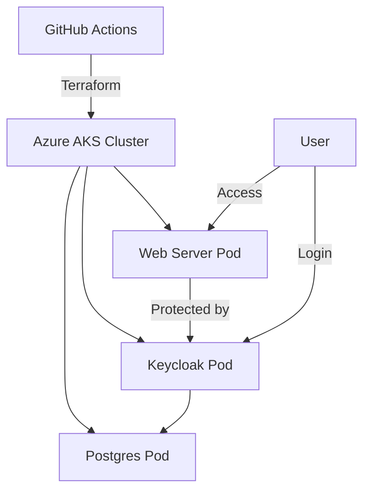

# Keycloak on AKS with Postgres and Protected Webpage

## Overview

This project provisions an Azure Kubernetes Service (AKS) cluster using Terraform, and deploys a Keycloak identity provider, a Postgres database, and a static web server. The web page is protected by Keycloak authentication. All application configuration is managed via Ansible, and the entire workflow is automated with GitHub Actions.

---

## Architecture



- **AKS**: Hosts all application containers.
- **Keycloak**: Provides authentication and authorization.
- **Postgres**: Backend database for Keycloak.
- **Web Server**: Serves static content, protected by Keycloak.
- **Ingress**: Routes external traffic to services.

---

## Components & Justification

### Why these components?
- **AKS**: Managed Kubernetes, easy scaling, Azure integration, and secure.
- **Keycloak**: Open-source, robust identity and access management.
- **Postgres**: Reliable, open-source database, well-supported by Keycloak.
- **NGINX (web server)**: Lightweight, perfect for serving static content.
- **Terraform**: Industry-standard for infrastructure as code.
- **Ansible**: Idempotent, agentless configuration management.
- **GitHub Actions**: Seamless CI/CD integration with GitHub.

### Why not other components?
- **No Azure App Service/Container Instances**: AKS is more flexible for orchestrating multiple containers and advanced networking.
- **No managed Postgres**: For demo purposes, in-cluster Postgres is simpler; for production, use Azure Database for PostgreSQL.

### Images Used
- **Keycloak**: `quay.io/keycloak/keycloak:22.0.1`
- **Postgres**: `postgres:15`
- **Web**: `nginx:alpine`

### Network Configuration
- **Azure VNet/Subnet**: Isolates AKS and its workloads.
- **Kubernetes Services**: Internal communication between pods.
- **Ingress**: Exposes web and Keycloak endpoints securely.

### Container Environment Choice
- **Kubernetes (AKS)**: Orchestrates containers, provides scaling, self-healing, and easy integration with Azure services.

---

## Getting Started

### Prerequisites

- Azure subscription
- GitHub account
- [Azure CLI](https://docs.microsoft.com/en-us/cli/azure/install-azure-cli)
- [Terraform](https://www.terraform.io/downloads)
- [Ansible](https://docs.ansible.com/ansible/latest/installation_guide/intro_installation.html)

### 1. Clone the Repository

```sh
git clone https://github.com/yourusername/yourrepo.git
cd yourrepo
```

### 2. Set up Azure Credentials

- Create a Service Principal and add its credentials as GitHub Secrets:
  - `AZURE_CLIENT_ID`
  - `AZURE_CLIENT_SECRET`
  - `AZURE_SUBSCRIPTION_ID`
  - `AZURE_TENANT_ID`

### 3. Deploy via GitHub Actions

- Push to `main` or trigger the **Deploy Infrastructure and Apps** workflow in the Actions tab.

### 4. Access the Application

- After deployment, find the Ingress or LoadBalancer IP in the Azure portal or via:
  ```sh
  kubectl --kubeconfig=keycloak-on-aks/ansible/kubeconfig get ingress
  ```
- Visit the web page in your browser. You should be redirected to Keycloak for authentication.

### 5. Destroy the Environment

- Trigger the **Destroy Infrastructure** workflow in GitHub Actions to tear down all resources.

---

## Possible Extensions & Benefits

- **Use Azure Database for PostgreSQL**: Managed, scalable, and more secure.
- **Enable HTTPS on Ingress**: Secure traffic with TLS certificates.
- **Add monitoring/logging**: Integrate with Prometheus, Grafana, or Azure Monitor.
- **Autoscaling**: Enable horizontal pod autoscaling for high availability.
- **External Secrets**: Integrate with Azure Key Vault for secret management.
- **CI/CD for app updates**: Automate web content or Keycloak realm updates.

---

## License

MIT
